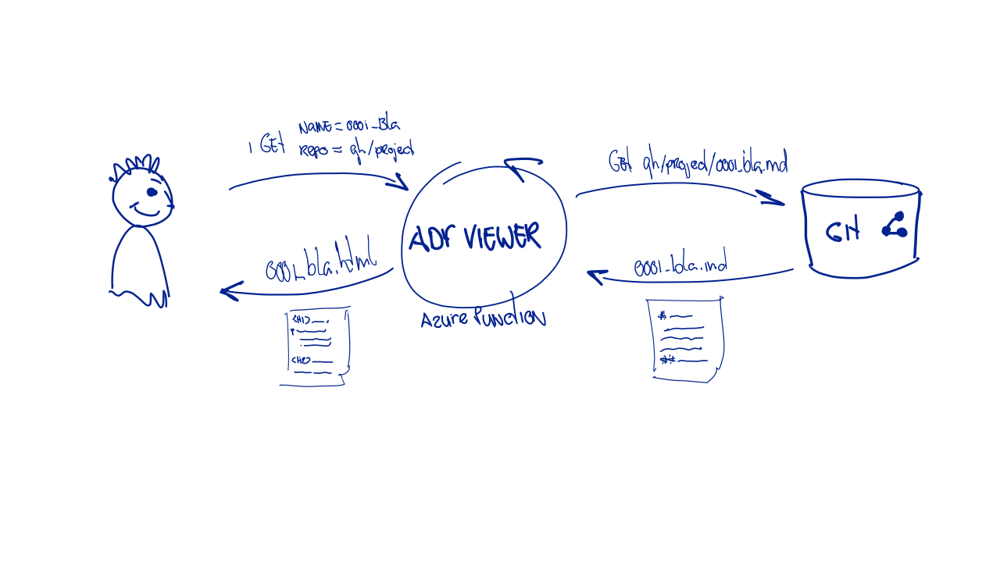

# Exercise

Your project uses Nat Price's adr tool to document Adr records.
Architectural Decisions are kept track of and the light weight format of markdown files in git combined with a small command line script to manage them serves the project well.

The records are stored in github ([https://github/qwaneu/adr-spike](https://github.com/qwaneu/adr-spike/)).

There's one issue with the current setup. Price's tool does not support convertions to html and it is hard to keep an overview of all the records. The teams want a better way of navigation and rendering. 

Specifically they want:

* the markdown records rendered as html.
* a link to the index in each html page.
* an index.html containing the list of pages as well as a graphical representation of the relations between the records.


The current structure of any repo containing records is like this:

```
└── doc
    └── adr
        ├── 0001-record-architecture-decisions.md
        ├── 000N-other-records.md
        ├── index.dot
        ├── index.md
```

All records are stored in a markdown file. There may be links between the records which look like this:

```markdown
[4. decouple HR++](0004-decouple-hr.md)
```
(i.e. the links point to markdown based records)

An ADR structure _always_ contains an index.md and an index.dot. The index.md is a bulleted list of all files. And the index.dot is a graphviz file containing links to the records. 

_note that the links in the dot file are links to (non existing) html files, not to markdown files._

# An Azure function

There is an explicit wish not to store markdown-to-html converted files anywhere. Someone came up with the idea to 
convert the html files when requested through an azure function. You took the challenge to do that.

So the idea is to 

*create an azure function that:*

* is triggered on an http request
* takes the `name of the record` and the `github repositories https url` as a parameter
* renders a html version of the record with a header containing a 'home' link to the index
* makes sure that potential links to other records in the html is adjusted so that they refer to the same function with the correct paramters.
* renders the index page as a list of pages and the graph of all records. 

And of course, you'll test drive the function.




# Preparing the exercise

In order to be able to work on the exercise you will need to:

* install python
* install azure cli
* install the Azure Functions Core tools
* install visual studio code
* install the Azure Functions extension for visual studio code 

## install python

Install python 3.12.0 from [https://www.python.org/downloads/](https://www.python.org/downloads/)

## install azure cli

Go to the [How to install Azure CLI](https://learn.microsoft.com/en-us/cli/azure/install-azure-cli) page for instructions.

## install the Azure Functions Core tools

Go to the [Develop Azure Functions Locally using Core tools](https://learn.microsoft.com/en-us/azure/azure-functions/functions-run-local?tabs=linux%2Cisolated-process%2Cnode-v4%2Cpython-v2%2Chttp-trigger%2Ccontainer-apps&pivots=programming-language-python#install-the-azure-functions-core-tools) page for instructions.

## install visual studio code

Install visual studio code from [https://code.visualstudio.com/download](https://code.visualstudio.com/download)


## install the Azure Functions extension for visual studio code 

Open visual studio code. hit ctrl-p and type: `ext install ms-azuretools.vscode-azurefunctions`

## Open this project and get started

Open this project in vs code. Then open a terminal (preferrably bash). Create a virtual environment:

```bash
python -m venv venv
```

Close the terminal and open it again. Code should have activated the environment, by running

```bash
source <absolute path to>venv/bin/activate 
```
If not, activate it yourself.

Now install the dependencies:

```bash
pip install -r requirements.txt -r requirements-dev.txt
```

You should now be able to 

1. Run the tests

```bash
./run-test.sh watch
```

2. Run the function locally

```bash
./run-local.sh
```

3. Create the function app in the cloud

First login to Azure 

```bash
az login
```

```bash
./provision-funcion-app.sh
```

3. Deploy the function app in the cloud

```bash
./publish-app.sh
```
